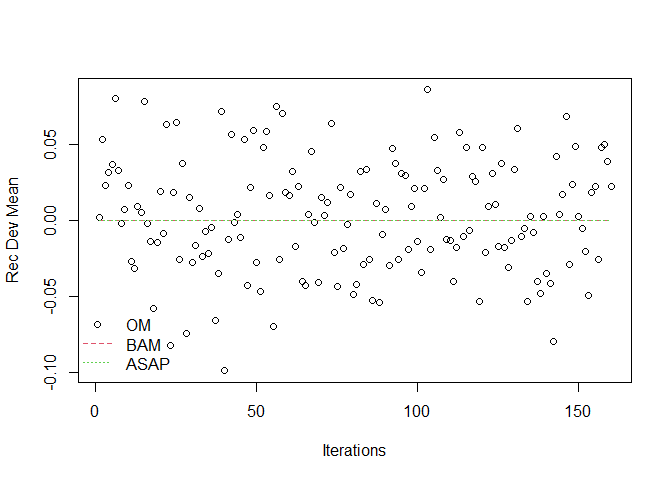
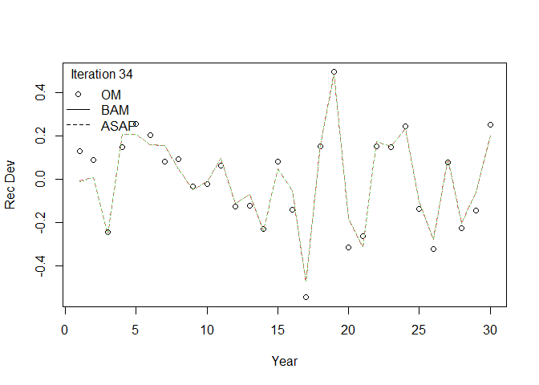
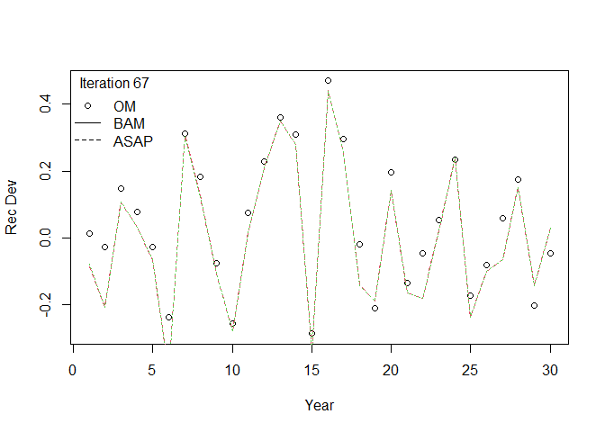
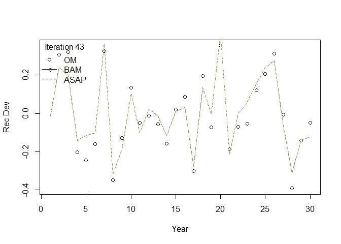

## Load model comparison project recruitment deviations from the null case

-   Operating model recruitment deviations
-   Beaufort Assessment Model (BAM) recruitment deviations
-   Age Structure Assessment Program (ASAP) recruitment deviations

<!-- -->

    project_path <- "C:/Users/bai.li/Desktop/mcp_results_r/final_cases/"
    case <- paste0("case", 0)

    iter_num <- 160
    nyr <- 30
    om <- bam <- asap <- matrix(NA, nrow = iter_num, ncol = nyr)

    for (iter in 1:iter_num) {

      # load OM recruitment deviations
      load(file.path(project_path, case, "output", "OM", paste0("OM", iter, ".RData")))
      om[iter, ] <- om_input$logR.resid

      # load BAM recruitment deviations
      bam_output <- dget(file.path(project_path, case, "output", "BAM", paste("s", iter, sep = ""), "bam-sim.rdat"))
      bam[iter, ] <- bam_output$t.series$logR.dev[bam_output$t.series$year %in% om_input$yr]

      # load ASAP recruitment deviations
      asap_output <- dget(file.path(project_path, case, "output", "ASAP", paste("s", iter, sep = ""), "asap3.rdat"))
      asap[iter, ] <- asap_output$SR.resids$logR.dev
    }

## Plot mean, sd, and sum of the recruitment deviations from OM, BAM, and ASAP

    om_mean <- apply(om, 1, mean)
    bam_mean <- apply(bam, 1, mean)
    asap_mean <- apply(asap, 1, mean)

    om_sd <- apply(om, 1, sd)
    bam_sd <- apply(bam, 1, sd)
    asap_sd <- apply(asap, 1, sd)

    om_sum <- apply(om, 1, sum)
    bam_sum <- apply(bam, 1, sum)
    asap_sum <- apply(asap, 1, sum)

    plot(om_mean,
      xlab = "Iterations",
      ylab = "Rec Dev Mean",
      pch = 1
    )
    lines(bam_mean, lty = 2, co = 2)
    lines(asap_mean, lty = 3, col = 3)
    legend("bottomleft",
      c("OM", "BAM", "ASAP"),
      lty = c(NA, 2:3),
      col = 1:3,
      pch = c(1, NA, NA),
      bty = "n"
    )

    plot(om_sd,
      xlab = "Iterations",
      ylab = "Rec Dev SD"
    )
    lines(bam_sd, lty = 2, co = 2)
    lines(asap_sd, lty = 3, col = 3)
    legend("bottomleft",
      c("OM", "BAM", "ASAP"),
      lty = c(NA, 2:3),
      col = 1:3,
      pch = c(1, NA, NA),
      bty = "n"
    )

    plot(om_sum,
      xlab = "Iterations",
      ylab = "Rec Dev Sum"
    )
    lines(bam_sum, lty = 2, co = 2)
    lines(asap_sum, lty = 3, col = 3)
    legend("bottomleft",
      c("OM", "BAM", "ASAP"),
      lty = c(NA, 2:3),
      col = 1:3,
      pch = c(1, NA, NA),
      bty = "n"
    )

## Plot recruitment deviations over years from 5 iteration runs

    iter_id <- sample(1:iter_num, 5, replace = F)
    for (i in 1:length(iter_id)) {
      plot(om[iter_id[i], ],
        xlab = "Year",
        ylab = "Rec Dev"
      )
      lines(bam[iter_id[i], ], lty = 2, col = 2)
      lines(asap[iter_id[i], ], lty = 3, col = 3)
      legend("topleft",
        c("OM", "BAM", "ASAP"),
        lty = c(NA, 1, 2),
        pch = c(1, NA, NA),
        title = paste("Iteration", iter_id[i]),
        bty = "n"
      )
    }

## Plot mean, sd, and sum of the recruitment deviations from MAS

    mas_dir <- "C:/Users/bai.li/Documents/Github/r4MAS-model-comparison/ASSAMC_comparison/snapper_grouper/"

    case_id <- "C1"

    iter_num <- 120
    nyr <- 30
    om <- mas <- matrix(NA, nrow = iter_num, ncol = nyr)

    for (iter in 1:iter_num) {

      # load OM recruitment deviations
      load(file.path(mas_dir, case_id, "output", "OM", paste0("OM", iter, ".RData")))
      om[iter, ] <- om_input$logR.resid

      # load MAS recruitment deviations
      output_file <- file.path(mas_dir, case_id, "output", "MAS", paste0("s", iter), paste0("s", iter, ".json"))
      mas_output <- jsonlite::read_json(output_file)

      parameter <- unlist(mas_output$estimated_parameters$parameters)
      parameter_table <- as.data.frame(matrix(parameter, ncol = 3, byrow = TRUE))
      colnames(parameter_table) <- c(
        "Parameter",
        "Value",
        "Gradient"
      )
      mas[iter, ] <- as.numeric(parameter_table[grep("recruitment_deviations", parameter_table$Parameter), "Value"])
    }

    om_mean <- apply(om, 1, mean)
    mas_mean <- apply(mas, 1, mean)

    om_sd <- apply(om, 1, sd)
    mas_sd <- apply(mas, 1, sd)

    om_sum <- apply(om, 1, sum)
    mas_sum <- apply(mas, 1, sum)

    plot(om_mean,
      xlab = "Iterations",
      ylab = "Rec Dev Mean",
      pch = 1
    )
    lines(mas_mean, lty = 2, co = 2)
    legend("bottomleft",
      c("OM", "MAS"),
      lty = c(NA, 2),
      col = 1:2,
      pch = c(1, NA),
      bty = "n"
    )

    plot(om_sd,
      xlab = "Iterations",
      ylab = "Rec Dev SD"
    )
    lines(mas_sd, lty = 2, co = 2)
    legend("bottomleft",
      c("OM", "MAS"),
      lty = c(NA, 2),
      col = 1:2,
      pch = c(1, NA),
      bty = "n"
    )

    plot(om_sum,
      xlab = "Iterations",
      ylab = "Rec Dev Sum"
    )
    lines(mas_sum, lty = 2, co = 2)
    legend("bottomleft",
      c("OM", "MAS"),
      lty = c(NA, 2),
      col = 1:2,
      pch = c(1, NA),
      bty = "n"
    )

## Questions

-   Does the constrained normal distribution help EM gets accurate
    estimates?

-   Does the OM need to simulate data that exactly satisfy a set of
    constraints?

    -   `mvrnorm` from `MASS` in R allows you to simulate multivariate
        normal data with a pre-specified sample mean and covariance by
        setting `empirical=TRUE`

-   Where are the source code of constrained normal distribution in
    ADMB?

    -   ADMB code to generate random numbers: [Page
        7](https://www.admb-project.org/courses/previous/july-2009/DataInOut.pdf)
